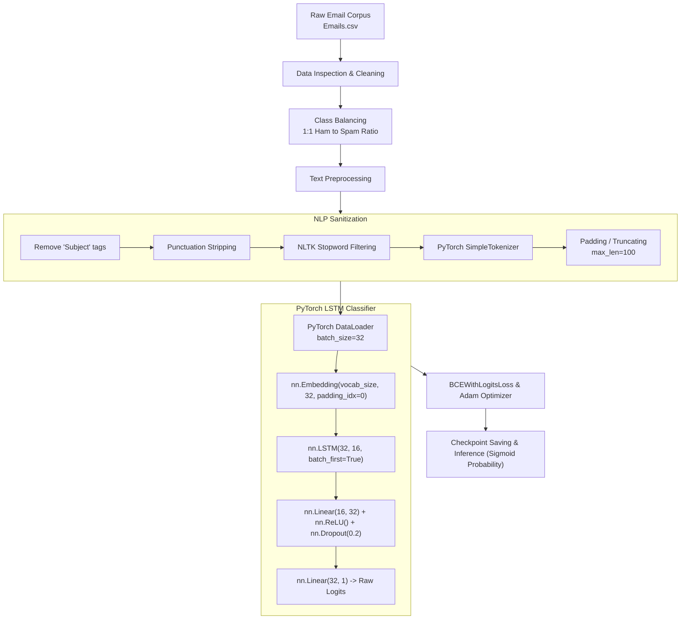

# 🛡️ Spam Email Detection System (PyTorch)

[](https://colab.research.google.com/github/imrup9/Spam-Email-Detection-/blob/main/Spam_Email_Detection_PyTorch.ipynb)
[](https://www.python.org/)
[](https://pytorch.org/)
[](https://github.com/imrup9/Spam-Email-Detection-)
[](#)
[](LICENSE)

A production-grade Natural Language Processing (NLP) and Deep Learning pipeline implemented in **PyTorch** to detect and classify emails as **Spam** or **Ham (Legitimate)**. Built with **PyTorch (`torch.nn`)**, **NLTK**, and a **Long Short-Term Memory (LSTM)** recurrent network, this project filters malicious solicitations, phishing campaigns, and inbox clutter by learning contextual word dependencies.

---

## 📌 Table of Contents

- [Overview](#-overview)
- [Key Features](#-key-features)
- [System Architecture & Pipeline](#-system-architecture--pipeline)
- [PyTorch Model Architecture](#-pytorch-model-architecture)
- [Dataset & Preprocessing](#-dataset--preprocessing)
- [Project Structure](#-project-structure)
- [Installation & Setup](#-installation--setup)
- [Training the Model](#-training-the-model)
- [Inference & CLI Predictions](#-inference--cli-predictions)
- [Interactive Notebook](#-interactive-notebook)
- [Roadmap & Enhancements](#-roadmap--enhancements)
- [Contributing](#-contributing)
- [License](#-license)

---

## 🌟 Overview

Email spam presents continuous cybersecurity risks, including phishing scams, credential theft, and malware distribution. 

This repository provides a modular, production-ready **PyTorch** implementation:
- Preprocesses raw email text corpora (header stripping, punctuation removal, NLTK stopwords filtering).
- Eliminates class bias through stratified downsampling.
- Employs a custom, lightweight PyTorch vocabulary manager and tokenizer.
- Implements a recurrent neural network using `nn.Embedding` and `nn.LSTM`.
- Employs numerical stability with `nn.BCEWithLogitsLoss()`.
- Supports checkpointing, early stopping, dynamic learning rate adjustment, and easy CLI inference.

---

## 🚀 Key Features

- **Built with Native PyTorch**: Explicit tensor control, modular `torch.nn.Module` classes, and standard `torch.utils.data.DataLoader` execution.
- **Device Agnostic**: Seamlessly switches between NVIDIA CUDA GPU and CPU (`torch.device`).
- **Text Normalization Engine**: Removes boilerplates (`Subject:` prefixes), normalizes text casing, strips punctuation, and purges non-informative English stopwords.
- **Class Rebalancing**: Downsamples majority ham records to maintain a 1:1 balance, preventing skewed classification thresholds.
- **Production Early Stopping & LR Scheduling**: Includes early stopping to preserve optimal weights and `torch.optim.lr_scheduler.ReduceLROnPlateau` for learning rate decay.
- **CLI & Module Ready**: Structured into modular files ([`model.py`](file:///c:/Users/rupam%20maity/Desktop/Projects/Spam%20Email%20Detection%20System/Spam-Email-Detection/model.py), [`train_pytorch.py`](file:///c:/Users/rupam%20maity/Desktop/Projects/Spam%20Email%20Detection%20System/Spam-Email-Detection/train_pytorch.py), and [`predict.py`](file:///c:/Users/rupam%20maity/Desktop/Projects/Spam%20Email%20Detection%20System/Spam-Email-Detection/predict.py)) alongside a complete Jupyter notebook.

---

## 🏗️ System Architecture & Pipeline



---

## 🔬 PyTorch Model Architecture

The model is defined in [`model.py`](file:///c:/Users/rupam%20maity/Desktop/Projects/Spam%20Email%20Detection%20System/Spam-Email-Detection/model.py) as `SpamLSTMClassifier`:

```python
import torch.nn as nn

class SpamLSTMClassifier(nn.Module):
    def __init__(self, vocab_size, embedding_dim=32, hidden_dim=16, dense_dim=32, dropout=0.2):
        super(SpamLSTMClassifier, self).__init__()
        self.embedding = nn.Embedding(vocab_size, embedding_dim, padding_idx=0)
        self.lstm = nn.LSTM(embedding_dim, hidden_dim, batch_first=True)
        self.fc1 = nn.Linear(hidden_dim, dense_dim)
        self.relu = nn.ReLU()
        self.dropout = nn.Dropout(dropout)
        self.fc2 = nn.Linear(dense_dim, 1)

    def forward(self, x):
        embedded = self.embedding(x)
        lstm_out, (hn, cn) = self.lstm(embedded)
        dense = self.fc1(hn[-1])
        dense = self.dropout(self.relu(dense))
        return self.fc2(dense).squeeze(-1)  # Returns logits
```

### Layer Specification

| Layer | PyTorch Module | Parameters / Shape | Function |
| :--- | :--- | :--- | :--- |
| **Embedding** | `nn.Embedding` | `num_embeddings=vocab_size`, `embedding_dim=32` | Maps token indices to dense representations (`padding_idx=0`) |
| **LSTM** | `nn.LSTM` | `input_size=32`, `hidden_size=16`, `batch_first=True` | Extracts temporal context across token sequences |
| **Dense 1** | `nn.Linear` | `in_features=16`, `out_features=32` | High-level non-linear feature projection |
| **Activation**| `nn.ReLU` + `nn.Dropout(0.2)` | — | Non-linearity & regularization against overfitting |
| **Dense 2** | `nn.Linear` (Output) | `in_features=32`, `out_features=1` | Generates scalar logit ($\sigma(\text{logit}) \in [0, 1]$) |

---

## 📊 Dataset & Preprocessing

- **Dataset**: `Emails.csv` (Enron email corpus subset containing ~5,171 samples).
- **Target Variable**: Binary classification (`0` = `ham`, `1` = `spam`).
- **Resampling**: The majority class (`ham`) is downsampled to match the total count of `spam` emails.
- **Normalization Strategy**:
  1. Strip the header keyword `"Subject"`.
  2. Remove standard ASCII punctuation marks.
  3. Filter words against the NLTK English stopwords dictionary.
  4. Pad or truncate to a maximum sequence length of `100` tokens.

---

## 📁 Project Structure

```text
Spam-Email-Detection/
│
├── checkpoints/                      # Saved PyTorch model weights & token vocabulary
│   ├── spam_model.pt                 # Optimal trained model checkpoint
│   └── vocab.json                    # Word-to-index vocabulary
│
├── notebooks/                        # Research and exploratory notebooks
│   └── Spam_Email_Detection_TensorFlow.ipynb  # Legacy TensorFlow/Keras notebook
│
├── Spam_Email_Detection_PyTorch.ipynb# Interactive PyTorch pipeline (EDA, training, testing)
├── model.py                          # PyTorch SpamLSTMClassifier architecture & SimpleTokenizer
├── train_pytorch.py                  # CLI training pipeline (Class balancing, EarlyStopping)
├── predict.py                        # Standalone CLI & programmatic inference module
├── requirements.txt                  # Python package dependencies
├── .gitignore                        # Git exclusion rules (cache, venv, checkpoints, data)
└── README.md                         # Production documentation & user guide
```

---

## ⚙️ Installation & Setup

### 1. Clone the Repository

```bash
git clone https://github.com/imrup9/Spam-Email-Detection-.git
cd Spam-Email-Detection-
```

### 2. Create Virtual Environment

**On Linux / macOS:**
```bash
python3 -m venv venv
source venv/bin/activate
```

**On Windows:**
```powershell
python -m venv venv
venv\Scripts\activate
```

### 3. Install Dependencies

Install required libraries via [requirements.txt](file:///c:/Users/rupam%20maity/Desktop/Projects/Spam%20Email%20Detection%20System/Spam-Email-Detection/requirements.txt):

```bash
pip install -r requirements.txt
```

*(Note: For GPU-accelerated PyTorch installation with CUDA, visit [pytorch.org](https://pytorch.org/get-started/locally/) to select the matching CUDA driver).*

### 4. Cache NLTK Stopwords

```bash
python -c "import nltk; nltk.download('stopwords')"
```

---

## 🚀 Training the Model

To train the PyTorch model from the command line:

```bash
python train_pytorch.py --data Emails.csv --epochs 20 --batch_size 32 --lr 0.001
```

### Optional Command-Line Arguments

| Argument | Default | Description |
| :--- | :--- | :--- |
| `--data` | `Emails.csv` | Path to the email dataset CSV file |
| `--epochs` | `20` | Maximum number of training epochs |
| `--batch_size` | `32` | Batch size for train and test DataLoaders |
| `--lr` | `0.001` | Initial Adam learning rate |
| `--max_len` | `100` | Sequence padding / truncation threshold |
| `--patience` | `3` | Early stopping epoch patience |
| `--save_model`| `spam_model.pt` | File path to store best PyTorch model weights |
| `--save_vocab`| `vocab.json` | File path to store serialized tokenizer vocabulary |

---

## 🔍 Inference & CLI Predictions

Classify any email message using the trained PyTorch checkpoint:

```bash
python predict.py "Congratulations! You have been selected for a $1,000 Walmart Gift Card. Click here now!"
```

**Sample Output:**
```text
==================================================
📧 Input Email : Congratulations! You have been selected for a $1,000 Walmart Gift Card. Click here now!
🏷️  Prediction  : SPAM
🎯 Confidence  : 98.42% (Spam Probability: 0.9842)
==================================================
```

### Using in Python Code

```python
from predict import predict

email = "Hey team, the project status meeting is rescheduled to Thursday at 3 PM."
label, confidence, prob = predict(email)
print(f"Result: {label} (Confidence: {confidence*100:.2f}%)")
```

---

## 📓 Interactive Notebook

You can also run the full pipeline interactively inside [Spam_Email_Detection_PyTorch.ipynb](file:///c:/Users/rupam%20maity/Desktop/Projects/Spam%20Email%20Detection%20System/Spam-Email-Detection/Spam_Email_Detection_PyTorch.ipynb). It includes:
- Dataset exploration and count plots
- WordCloud generation for both Spam and Ham
- Step-by-step PyTorch training and loss/accuracy plots
- Confusion matrix and evaluation on custom inputs

---

## 🗺️ Roadmap & Enhancements

- [ ] **Pre-trained Embeddings**: Integrate GloVe or Word2Vec word representations.
- [ ] **Transformer Models**: Transition to Hugging Face `transformers` (`DistilBERT` / `RoBERTa`).
- [ ] **FastAPI Deployment**: Package the PyTorch inference pipeline into an asynchronous REST API.
- [ ] **Containerization**: Create a `Dockerfile` for containerized inference.

---

## 🤝 Contributing

1. Fork the Project.
2. Create your Feature Branch (`git checkout -b feature/NewFeature`).
3. Commit your Changes (`git commit -m 'feat: Add NewFeature'`).
4. Push to the Branch (`git push origin feature/NewFeature`).
5. Open a Pull Request.

---

## 📄 License

This project is licensed under the [MIT License](LICENSE).