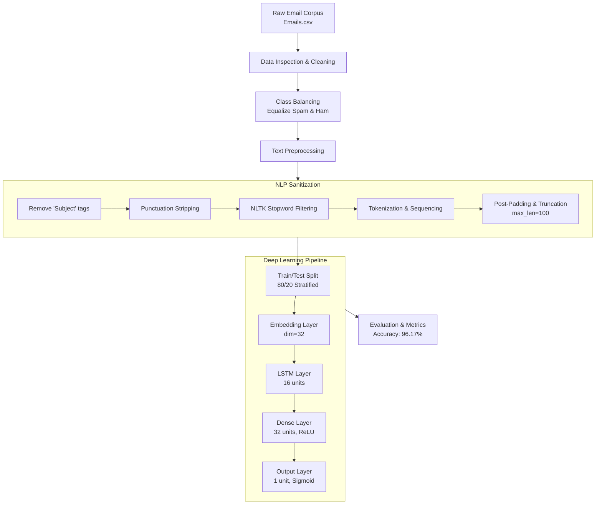

# 🛡️ Spam Email Detection System

[](https://colab.research.google.com/github/imrup9/Spam-Email-Detection-/blob/main/Spam_Email_Detection.ipynb)
[](https://www.python.org/)
[](https://tensorflow.org)
[](https://github.com/imrup9/Spam-Email-Detection-)
[](#)
[](LICENSE)

An end-to-end Natural Language Processing (NLP) and Deep Learning pipeline designed to classify emails as **Spam** or **Ham (Legitimate)** with high precision. Built with **TensorFlow / Keras**, **NLTK**, and **Long Short-Term Memory (LSTM)** neural networks, this project addresses email security risks, unwanted solicitations, and phishing attacks by capturing context-aware semantic dependencies in textual sequences.

---

## 📌 Table of Contents

- [Overview](#-overview)
- [Key Features](#-key-features)
- [System Architecture & Pipeline](#-system-architecture--pipeline)
- [Model Specification](#-model-specification)
- [Dataset & Preprocessing](#-dataset--preprocessing)
- [Performance & Benchmark Results](#-performance--benchmark-results)
- [Project Structure](#-project-structure)
- [Installation & Setup](#-installation--setup)
- [Usage & Execution](#-usage--execution)
- [Inference Example](#-inference-example)
- [Roadmap & Enhancements](#-roadmap--enhancements)
- [Contributing](#-contributing)
- [License](#-license)

---

## 🌟 Overview

Email spam constitutes a significant portion of daily digital communications, posing cybersecurity threats such as phishing scams, credential harvesting, malware distribution, and productivity loss. 

This repository implements a robust deep learning text classification workflow:
- Ingests raw email text corpora.
- Performs domain-specific text sanitization (header cleaning, punctuation stripping, stopword elimination).
- Mitigates class imbalance via stratified downsampling.
- Vectorizes text sequences using word embeddings.
- Trains an **LSTM recurrent neural network** capable of learning sequential order and semantic dependencies across variable-length messages.
- Achieves **~96.17% accuracy** on unseen test evaluations.

---

## 🚀 Key Features

- **Text Normalization Engine**: Removes boilerplates (`Subject:` prefixes), standardizes casing, eliminates punctuation, and filters non-informative English stopwords using NLTK.
- **Exploratory Data Analysis (EDA)**: Includes distribution plots and class-specific **Word Clouds** comparing vocabulary frequency in Spam vs. Ham emails.
- **Balanced Class Distribution**: Employs controlled downsampling of majority ham records to prevent model bias towards common non-spam signatures.
- **Sequence Processing**: Tokenization with sequence length thresholding (`max_len = 100`) and post-padding to maintain matrix uniformity for batch processing.
- **Recurrent Architecture (LSTM)**: Incorporates an Embedding layer paired with LSTM cells to extract long-range contextual semantic representations.
- **Production-Oriented Callbacks**: Leverages `EarlyStopping` (restoring optimal validation weights) and adaptive learning rate decay (`ReduceLROnPlateau`) to avoid overfitting.

---

## 🏗️ System Architecture & Pipeline



---

## 🔬 Model Specification

The network is compiled with the **Adam optimizer** and monitored using **Binary Cross-Entropy Loss**.

### Layer Configuration

| Layer | Type | Configuration / Dimensions | Purpose |
| :--- | :--- | :--- | :--- |
| **1** | `Embedding` | `input_dim = Vocab Size + 1`, `output_dim = 32`, `input_length = 100` | Projects sparse token IDs into dense semantic vector space |
| **2** | `LSTM` | `units = 16` | Captures directional sequence dynamics and contextual dependencies |
| **3** | `Dense` | `units = 32`, `activation = 'relu'` | Deep nonlinear feature abstraction |
| **4** | `Dense` (Output) | `units = 1`, `activation = 'sigmoid'` | Outputs probability of message being spam ($\hat{y} \in [0, 1]$) |

### Training Hyperparameters & Regularization

- **Batch Size**: `32`
- **Max Epochs**: `20` (Early stopping restored best weights at epoch 7)
- **Optimizer**: `Adam` (Initial learning rate: `0.001`)
- **Loss Function**: `BinaryCrossentropy`
- **Callbacks**:
  - `EarlyStopping`: `monitor='val_accuracy'`, `patience=3`, `restore_best_weights=True`
  - `ReduceLROnPlateau`: `monitor='val_loss'`, `factor=0.5`, `patience=2`

---

## 📊 Dataset & Preprocessing

The model is trained on an email classification corpus (Enron Email derived dataset) with initial attributes:

- **Total Samples**: `5,171` emails
- **Columns**: `Unnamed: 0`, `label` (`ham` / `spam`), `text`, `label_num` (`0` / `1`)
- **Imbalance Handling**: Ham instances are downsampled to match the count of spam messages, preventing false negatives on malicious content.

### Cleaning Workflow

```python
# 1. Subject Prefix Stripping
df['text'] = df['text'].str.replace('Subject', '')

# 2. Punctuation Removal
df['text'] = df['text'].apply(lambda x: x.translate(str.maketrans('', '', string.punctuation)))

# 3. Stopwords Removal
stop_words = stopwords.words('english')
df['text'] = df['text'].apply(lambda x: " ".join([w.lower() for w in x.split() if w.lower() not in stop_words]))
```

---

## 📈 Performance & Benchmark Results

During evaluation on unseen validation/test data (20% holdout split), the model yielded the following metrics:

| Metric | Score |
| :--- | :--- |
| **Test Accuracy** | **96.17%** (`0.96167`) |
| **Test Loss** | **0.1564** |
| **Training Epochs to Convergence** | ~7–10 Epochs |
| **Model Footprint** | Extremely lightweight (< 1MB weights) |

### Training Progression Highlights
- **Epoch 1**: Val Accuracy: `80.83%` | Val Loss: `0.5429`
- **Epoch 4**: Val Accuracy: `95.00%` | Val Loss: `0.1720`
- **Epoch 7 (Optimal)**: Val Accuracy: `96.17%` | Val Loss: `0.1564`

---

## 📁 Project Structure

```text
Spam-Email-Detection/
│
├── Spam_Email_Detection.ipynb   # Main end-to-end Jupyter Notebook (EDA, training, evaluation)
├── Emails.csv                   # Email dataset (ham/spam text corpus)
├── README.md                    # Project documentation & execution guide
└── requirements.txt             # Environment dependencies (recommended)
```

---

## ⚙️ Installation & Setup

### 1. Clone the Repository

```bash
git clone https://github.com/imrup9/Spam-Email-Detection-.git
cd Spam-Email-Detection-
```

### 2. Create and Activate Virtual Environment

**On Linux / macOS:**
```bash
python3 -m venv venv
source venv/bin/activate
```

**On Windows:**
```powershell
python -m venv venv
venv\Scripts\activate
```

### 3. Install Dependencies

Install required libraries:

```bash
pip install numpy pandas matplotlib seaborn nltk wordcloud scikit-learn tensorflow
```

Alternatively, create a `requirements.txt`:
```text
numpy>=1.24.0
pandas>=2.0.0
matplotlib>=3.7.0
seaborn>=0.12.0
nltk>=3.8.0
wordcloud>=1.9.0
scikit-learn>=1.3.0
tensorflow>=2.12.0
```
and install with:
```bash
pip install -r requirements.txt
```

### 4. Download NLTK Resources

Run a quick Python command to ensure the NLTK stopword corpus is locally cached:

```bash
python -c "import nltk; nltk.download('stopwords')"
```

---

## 💻 Usage & Execution

### Option A: Run in Google Colab (Zero Setup)
Click the badge below to execute the entire notebook directly in Google Colab with GPU acceleration:

[](https://colab.research.google.com/github/imrup9/Spam-Email-Detection-/blob/main/Spam_Email_Detection.ipynb)

### Option B: Local Jupyter Environment
Launch Jupyter Notebook or JupyterLab:

```bash
jupyter notebook Spam_Email_Detection.ipynb
```

Execute cells sequentially to inspect data distribution, visualize word clouds, train the LSTM network, and generate accuracy curves.

---

## 🔍 Inference Example

To test unseen email content using the trained components:

```python
import string
import numpy as np
from tensorflow.keras.preprocessing.sequence import pad_sequences
from nltk.corpus import stopwords

def preprocess_sample(raw_text):
    # Remove 'Subject' prefix
    text = raw_text.replace("Subject", "")
    # Strip punctuation
    text = text.translate(str.maketrans('', '', string.punctuation))
    # Remove stopwords
    stop_words = set(stopwords.words('english'))
    cleaned = [w.lower() for w in text.split() if w.lower() not in stop_words]
    return " ".join(cleaned)

def predict_email(email_text, model, tokenizer, max_len=100, threshold=0.5):
    cleaned_text = preprocess_sample(email_text)
    seq = tokenizer.texts_to_sequences([cleaned_text])
    padded_seq = pad_sequences(seq, maxlen=max_len, padding='post', truncating='post')
    prob = model.predict(padded_seq)[0][0]
    
    label = "SPAM" if prob >= threshold else "HAM (Legitimate)"
    confidence = prob if prob >= threshold else (1.0 - prob)
    return label, float(confidence)

# Sample test:
sample_email = "Congratulations! You have won a $1,000 Walmart gift card. Click here to claim your reward now."
label, conf = predict_email(sample_email, model, tokenizer)
print(f"Prediction: {label} ({conf * 100:.2f}% confidence)")
```

---

## 🗺️ Roadmap & Enhancements

- [ ] **Transformer Ensembles**: Benchmark performance against state-of-the-art transformer architectures (`DistilBERT`, `RoBERTa`).
- [ ] **REST API Service**: Wrap the inference pipeline with **FastAPI** for low-latency batch and streaming email validation.
- [ ] **Containerization**: Provide a multi-stage `Dockerfile` and `docker-compose.yml` for isolated microservice deployment.
- [ ] **Interactive Dashboard**: Create a **Streamlit** or **Gradio** web app enabling real-time email drag-and-drop filtering.
- [ ] **Continuous Integration**: Implement GitHub Actions for linting, testing, and automated model validation.

---

## 🤝 Contributing

Contributions, bug reports, and feature proposals are welcome!

1. Fork the Project.
2. Create your Feature Branch (`git checkout -b feature/NewFeature`).
3. Commit your Changes (`git commit -m 'feat: Add NewFeature'`).
4. Push to the Branch (`git push origin feature/NewFeature`).
5. Open a Pull Request.

---

## 📄 License

This project is licensed under the [MIT License](LICENSE). You are free to use, modify, and distribute this software with attribution.